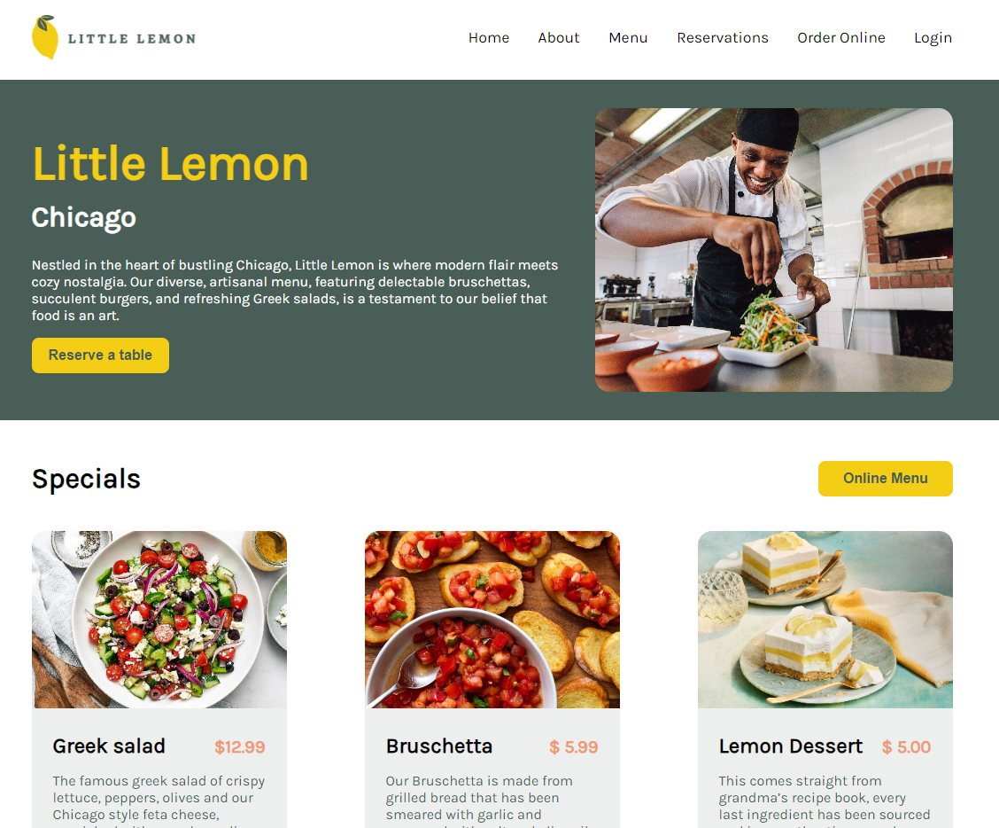

# Little Lemon 🍋

Welcome to the **Little Lemon Restaurant** website repository! This project was developed as part of the Meta Frontend Developer course and is powered by React. It features a sleek, modern interface that allows users to browse the restaurant's menu and easily make reservations.

## Live Demo

Take a look at the live site! [Live Demo](https://meta-frontend-capstone-bay.vercel.app/)

## Key Features

- **Seamless Navigation**: Effortlessly switch between different sections of the site.
- **Stylish Menu Display**: Explore the full menu with an intuitive design.
- **Interactive Reservations**: Book a table via a user-friendly form.
- **Instant Confirmation**: Get a popup confirmation right after booking.
- **React-Powered**: Enjoy a modern, responsive, and dynamic user experience.

## Available Commands

To get started, navigate to the project directory and run:

### `npm install`

Installs all necessary dependencies listed in the `package.json` file.

### `npm start`

Launches the app in development mode.\
Open [http://localhost:3000](http://localhost:3000) to see it in your browser.

### `npm test`

Starts the test runner in interactive watch mode.\
Make sure to write thorough tests to maintain the app’s stability. Test files are usually located in a `__tests__` folder or use `.test.js` or `.spec.js` extensions.
